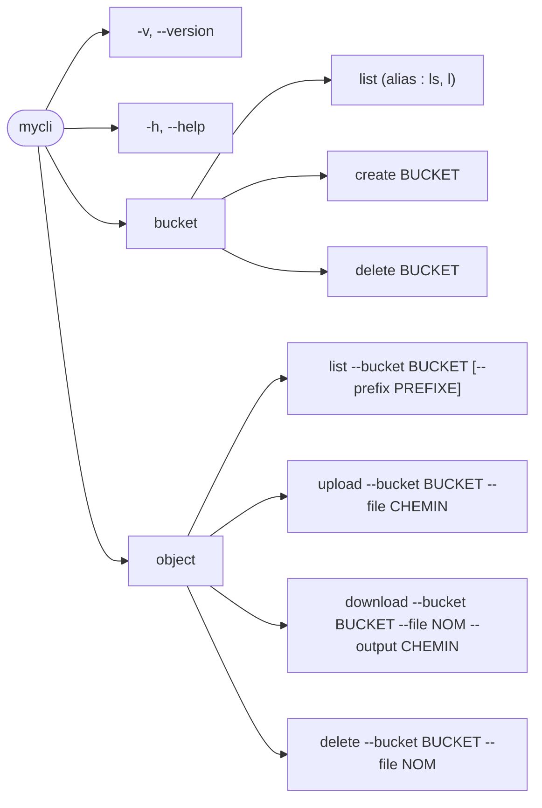

# plateforme-mycli

`mycli` est un client en ligne de commande pour un serveur de stockage
compatible S3, comme MinIO : il crée et supprime des buckets, et y envoie,
liste, télécharge et supprime des fichiers.

## Prérequis

### Pour utiliser `mycli`

- Un serveur compatible S3 accessible, par exemple MinIO
- Une clé d'accès et une clé secrète pour ce serveur

Le binaire n'a besoin ni de Go ni du dépôt.

### Pour développer

- Go 1.26.9 ou supérieur, la version utilisée par la CI
- Docker avec Docker Compose, pour le serveur MinIO local
- Make, et un shell compatible `sh` : sous Windows, Git Bash
- `curl`, utilisé par `make test` pour attendre que MinIO soit prêt
- [golangci-lint](https://golangci-lint.run/) pour `make go-lint` et
  `make go-lint-check`
- [govulncheck](https://pkg.go.dev/golang.org/x/vuln/cmd/govulncheck) pour
  `make go-deps-check` :
  `go install golang.org/x/vuln/cmd/govulncheck@latest`

## Installation

`mycli` est un binaire autonome : il ne demande ni Go ni le dépôt. Chaque
[release](https://github.com/ArthurDescourvieres/plateforme-mycli/releases)
publie un binaire par système.

| Système | Fichier à télécharger |
|---|---|
| Linux (x86-64) | `mycli_linux_amd64` |
| Linux (ARM) | `mycli_linux_arm64` |
| macOS (Intel) | `mycli_darwin_amd64` |
| macOS (Apple Silicon) | `mycli_darwin_arm64` |
| Windows (x86-64) | `mycli_windows_amd64.exe` |
| Windows (ARM) | `mycli_windows_arm64.exe` |

### Linux et macOS

Remplacer `mycli_linux_amd64` par le fichier qui correspond à la machine :

```bash
curl -L -o mycli https://github.com/ArthurDescourvieres/plateforme-mycli/releases/latest/download/mycli_linux_amd64
chmod +x mycli
sudo mv mycli /usr/local/bin/mycli
```

### Windows

Dans PowerShell :

```powershell
Invoke-WebRequest -Uri https://github.com/ArthurDescourvieres/plateforme-mycli/releases/latest/download/mycli_windows_amd64.exe -OutFile mycli.exe
```

Placer ensuite `mycli.exe` dans un dossier présent dans le `PATH`.

### Vérifier l'installation

```bash
mycli --version
mycli --help
```

Ces deux commandes fonctionnent sans configuration. Chaque release fournit
aussi un fichier `checksums.txt` pour vérifier l'intégrité du binaire
téléchargé.

## Configuration

`mycli` a besoin de l'adresse du serveur S3 et d'une paire de clés d'accès.
Elle se donne par des variables d'environnement ou par un fichier de
configuration.

### Variables d'environnement

| Variable | Rôle | Valeur par défaut |
|---|---|---|
| `MYCLI_URL` | Adresse du serveur S3 | `http://localhost:9000` |
| `MYCLI_ACCESS_KEY` | Clé d'accès | aucune, obligatoire |
| `MYCLI_SECRET_KEY` | Clé secrète | aucune, obligatoire |
| `MYCLI_REGION` | Région | `us-east-1` |

```bash
export MYCLI_URL=http://localhost:9000
export MYCLI_ACCESS_KEY=<votre-clé-d-accès>
export MYCLI_SECRET_KEY=<votre-clé-secrète>
```

### Fichier de configuration

Le fichier `~/.mycli/config.json` peut contenir plusieurs profils de
connexion. `default` désigne celui qui est utilisé :

```json
{
  "default": "local",
  "aliases": {
    "local": {
      "url": "http://localhost:9000",
      "access_key": "<votre-clé-d-accès>",
      "secret_key": "<votre-clé-secrète>",
      "region": "us-east-1"
    }
  }
}
```

La variable `MYCLI_CONFIG` permet d'utiliser un autre chemin pour ce fichier.

### Ordre de priorité

1. Les variables d'environnement `MYCLI_*`
2. Le profil par défaut du fichier de configuration
3. Les valeurs par défaut (`http://localhost:9000`, `us-east-1`)

Une variable d'environnement remplace donc la valeur correspondante du
fichier, sans toucher aux autres.

## Commandes en arborescence



Chaque commande accepte aussi `-h` ou `--help`.

| Commande | Rôle | Opération S3 | Requête HTTP |
|---|---|---|---|
| `mycli bucket list` | Lister les buckets | [ListBuckets](https://docs.aws.amazon.com/AmazonS3/latest/API/API_ListBuckets.html) | `GET /` |
| `mycli bucket create <bucket>` | Créer un bucket | [CreateBucket](https://docs.aws.amazon.com/AmazonS3/latest/API/API_CreateBucket.html) | `PUT /{bucket}` |
| `mycli bucket delete <bucket>` | Supprimer un bucket | [DeleteBucket](https://docs.aws.amazon.com/AmazonS3/latest/API/API_DeleteBucket.html) | `DELETE /{bucket}` |
| `mycli object upload --bucket <bucket> --file <chemin>` | Envoyer un fichier local dans un bucket | [PutObject](https://docs.aws.amazon.com/AmazonS3/latest/API/API_PutObject.html) | `PUT /{bucket}/{key}` |
| `mycli object list --bucket <bucket>` | Lister les fichiers d'un bucket | [ListObjectsV2](https://docs.aws.amazon.com/AmazonS3/latest/API/API_ListObjectsV2.html) | `GET /{bucket}?list-type=2` |
| `mycli object download --bucket <bucket> --file <nom> --output <chemin>` | Télécharger un fichier | [GetObject](https://docs.aws.amazon.com/AmazonS3/latest/API/API_GetObject.html) | `GET /{bucket}/{key}` |
| `mycli object delete --bucket <bucket> --file <nom>` | Supprimer un fichier d'un bucket | [DeleteObject](https://docs.aws.amazon.com/AmazonS3/latest/API/API_DeleteObject.html) | `DELETE /{bucket}/{key}` |

`mycli <commande> --help` affiche l'aide détaillée de chaque commande.

Les requêtes utilisent l'adressage par chemin (*path-style*) : le nom du bucket
est dans le chemin de l'URL (`http://localhost:9000/demo/rapport.txt`), et non
dans le nom de domaine. C'est le mode qui fonctionne avec un serveur local comme
MinIO.

### Correspondance avec les commandes du sujet

| Action demandée par le sujet | Nom cité dans le sujet | Commande `mycli` |
|---|---|---|
| Lister les buckets | `list-buckets` | `mycli bucket list` |
| Créer un bucket | `create-bucket` | `mycli bucket create <bucket>` |
| Supprimer un bucket | | `mycli bucket delete <bucket>` |
| Téléverser un fichier dans un bucket | `upload-file` | `mycli object upload --bucket <bucket> --file <chemin>` |
| Lister les objets d'un bucket | | `mycli object list --bucket <bucket>` |
| Télécharger un fichier depuis un bucket | | `mycli object download --bucket <bucket> --file <nom> --output <chemin>` |
| Supprimer un fichier d'un bucket | `delete-file` | `mycli object delete --bucket <bucket> --file <nom>` |

Le sujet cite quatre noms en exemple. Les commandes de `mycli` sont regroupées
par ressource (`bucket`, `object`), sur le modèle de clients comme `aws s3` ou
`mc`.

### Exemple complet

```console
$ mycli bucket create demo
Bucket created: demo

$ mycli bucket list
demo

$ mycli object upload --bucket demo --file rapport.txt
Object uploaded: demo/rapport.txt

$ mycli object list --bucket demo
rapport.txt

$ mycli object list --bucket demo --prefix rap
rapport.txt

$ mycli object download --bucket demo --file rapport.txt --output copie.txt
Object downloaded: demo/rapport.txt -> copie.txt

$ mycli object delete --bucket demo --file rapport.txt
Object deleted: demo/rapport.txt

$ mycli bucket delete demo
Bucket deleted: demo
```

En cas d'erreur, `mycli` affiche un message explicite et se termine avec un
code de sortie non nul :

```console
$ mycli bucket delete inconnu
[NoSuchBucket] bucket does not exist; create it first or check the name (http 404)
```

## Développement

Voir les [prérequis pour développer](#pour-développer). Toutes les commandes
`make` s'exécutent depuis la racine du dépôt.

Préparer l'environnement et lancer un serveur MinIO local :

```bash
make init
make launch
```

L'API S3 répond sur http://localhost:9000 et la console web sur
http://localhost:9001, avec les identifiants de développement définis dans
`docker/.env`.

Lancer le CLI depuis les sources, avec la configuration de `docker/.env` :

```bash
make mycli s="bucket list"
```

Lancer la suite de tests (MinIO est démarré si nécessaire) :

```bash
make test
```

`make help` liste toutes les commandes disponibles. Le lint, la vérification
des dépendances, la CI et le workflow de contribution sont décrits dans
[CONTRIBUTING.md](CONTRIBUTING.md).

## Références AWS

`mycli` s'appuie sur la documentation de l'API Amazon S3 :

- [Présentation de l'API Amazon S3](https://docs.aws.amazon.com/AmazonS3/latest/API/Welcome.html)
- Opérations sur les buckets :
  [ListBuckets](https://docs.aws.amazon.com/AmazonS3/latest/API/API_ListBuckets.html),
  [CreateBucket](https://docs.aws.amazon.com/AmazonS3/latest/API/API_CreateBucket.html),
  [DeleteBucket](https://docs.aws.amazon.com/AmazonS3/latest/API/API_DeleteBucket.html)
- Opérations sur les objets :
  [PutObject](https://docs.aws.amazon.com/AmazonS3/latest/API/API_PutObject.html),
  [ListObjectsV2](https://docs.aws.amazon.com/AmazonS3/latest/API/API_ListObjectsV2.html),
  [GetObject](https://docs.aws.amazon.com/AmazonS3/latest/API/API_GetObject.html),
  [DeleteObject](https://docs.aws.amazon.com/AmazonS3/latest/API/API_DeleteObject.html)
- [Signature des requêtes (AWS Signature Version 4)](https://docs.aws.amazon.com/AmazonS3/latest/API/sig-v4-authenticating-requests.html)
- [Réponses d'erreur et codes d'erreur S3](https://docs.aws.amazon.com/AmazonS3/latest/API/ErrorResponses.html)
- [Adressage par chemin et virtual-hosted](https://docs.aws.amazon.com/AmazonS3/latest/userguide/VirtualHosting.html)
- [Règles de nommage des buckets](https://docs.aws.amazon.com/AmazonS3/latest/userguide/bucketnamingrules.html)

Les requêtes sont construites et signées par le SDK
[aws-sdk-go-v2](https://pkg.go.dev/github.com/aws/aws-sdk-go-v2/service/s3).
